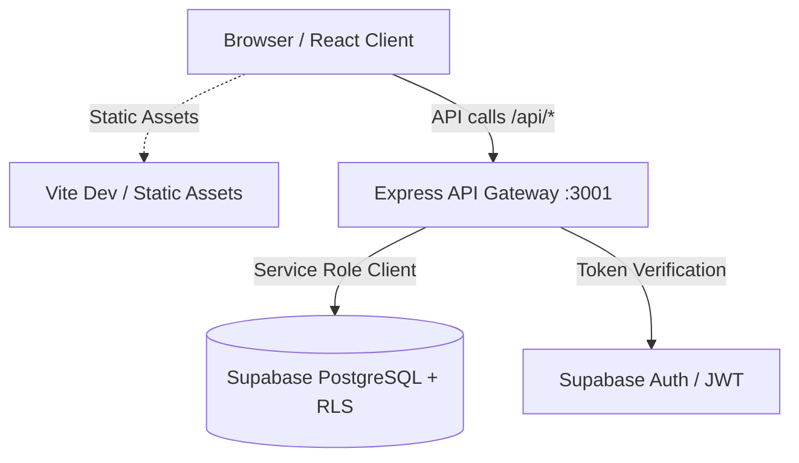

# Project Summary: AEGIS / Chain of Custody System

## 1. Overview

**AEGIS (Chain of Custody System)** is a digital evidence tracking, case management, and integrity audit platform designed for law enforcement, digital forensics units, and judicial compliance bodies. It guarantees an immutable audit trail and verifiable chain of custody for physical and digital evidence.

---

## 2. Architecture & Tech Stack



### Core Technologies
- **Frontend**: React 18, Vite, Tailwind CSS, Lucide React icons.
- **Backend**: Node.js, Express 5, CORS, Dotenv.
- **Database & Auth Engine**: Supabase (PostgreSQL with Row Level Security, Triggers, and JWT-based Auth).
- **Deployment & Hosting**: Configured for Vercel with path rewrites mapping `/api/*` to the serverless Express backend.

---

## 3. Directory & File Structure

```text
e:/AEGIS
├── backend/
│   ├── config/             # Supabase client instantiation with service role credentials
│   ├── controllers/        # Business logic & request validation (auth, case, evidence, audit, compliance)
│   ├── middleware/         # Auth verification, rate limiting, and global error handlers
│   ├── models/             # Schema definitions and data access layers
│   ├── routes/             # Express route endpoints
│   ├── supabase/           # SQL migration files, DB schema triggers, and RLS policies
│   └── server.js           # Express API server entrypoint
│
├── frontend/
│   ├── src/
│   │   ├── components/     # Reusable UI widgets and modal dialogues
│   │   ├── lib/            # Frontend API client and utility helpers
│   │   ├── screens/        # Primary views (Dashboard, Cases, Evidence, Audit, Compliance, Auth)
│   │   ├── App.jsx         # Authentication routing shell
│   │   ├── index.css       # Complete design system styling
│   │   └── main.jsx        # React root render
│   ├── .env.local          # Frontend local environment config
│   └── package.json        # Frontend scripts and deps
│
├── index.html              # HTML entry for Vite
├── package.json            # Root workspace scripts (concurrent frontend & backend run)
├── tailwind.config.js      # Styling design tokens
├── vite.config.js          # Vite configuration
└── vercel.json             # Vercel deployment and routing rules
```

---

## 4. Key Functional Modules

### 1. Authentication & Role-Based Access Control (RBAC)
- **Token-based**: Uses Supabase Auth tokens passed as Bearer headers (`coc_token`).
- **User Roles**:
  - `investigating_officer`: Creates and updates cases and logs evidence intake.
  - `evidence_officer`: Oversees transfers, storage location, and status transitions.
  - `auditor` & `admin`: Accesses the full immutable audit trail and compliance verification views.

### 2. Case Registry (`CasesView`)
- Manage and track legal cases, assigned officers, jurisdictions, priorities, and statuses.
- Real-time case search and status filtering.

### 3. Evidence Vault (`EvidenceView`)
- Digital and physical evidence cataloging.
- SHA-256 hash generation and verification to detect file tampering.
- Custody transfer log recording who handed over evidence, to whom, timestamps, and reason.

### 4. Audit Trail (`AuditView`)
- Immutable log records for actions (`CREATE`, `UPDATE`, `TRANSFER`, `VERIFY`).
- Audit logs track resource names, actor badges, IP addresses, and previous vs. updated states.

### 5. Compliance View (`ComplianceView`)
- Compliance checklist for ISO/IEC 27037 and legal standards on evidence admissibility.
- Real-time pass/fail integrity metrics.

---

## 5. Environment & Configuration Reference

### Backend (`backend/.env`)
- `PORT`: Server port (e.g. `3001` or `5000`).
- `SUPABASE_URL`: Supabase project URL (`https://<project-id>.supabase.co`).
- `SUPABASE_SERVICE_ROLE_KEY`: Elevated key used strictly by backend controllers to bypass/manage records according to business logic.
- `FRONTEND_URL`: Allowed CORS origin for local development.

### Frontend (`frontend/.env.local` / root `.env`)
- `VITE_API_URL`: Backend API URL (default: `http://localhost:3001/api`).
- `VITE_SUPABASE_URL`: Supabase project URL for direct client queries (if needed).
- `VITE_SUPABASE_ANON_KEY`: Safe public anon key for browser client authentication.

---

## 6. Common Scripts

| Command | Action |
| :--- | :--- |
| `npm run dev` | Runs both the Vite frontend and the Express backend concurrently |
| `npm run dev:frontend` | Runs the Vite development server only |
| `npm run dev:backend` | Runs the Express backend with `nodemon` live reload |
| `npm run build` | Builds the Vite frontend production bundle into `dist/` |
| `npm run lint` | Runs ESLint across the project |
